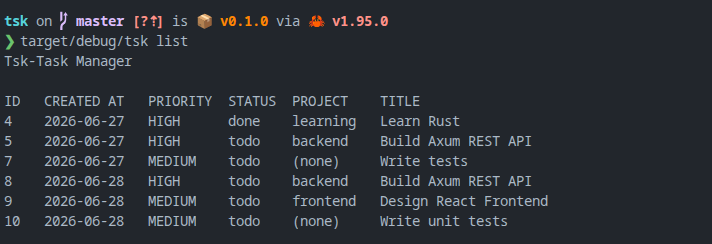
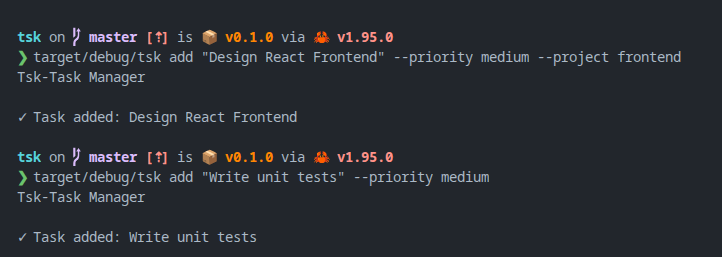
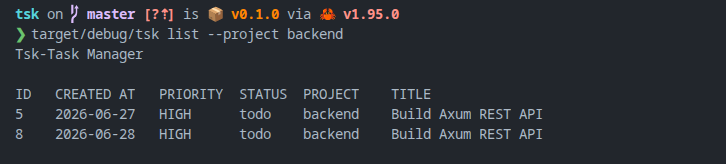
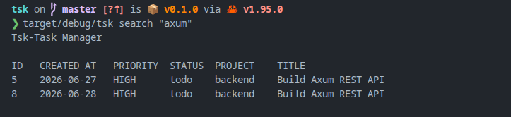
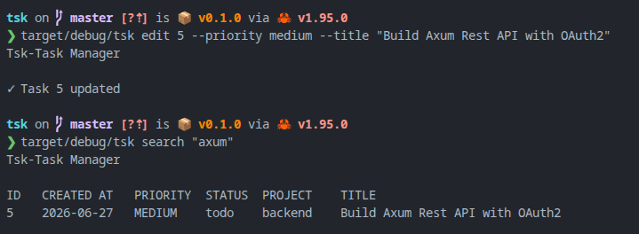
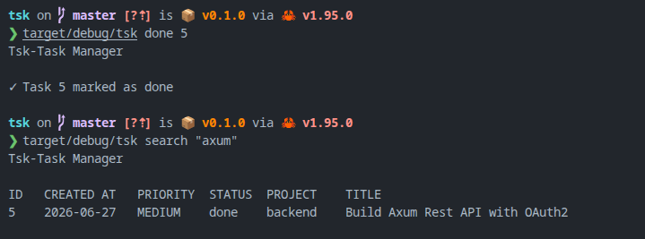
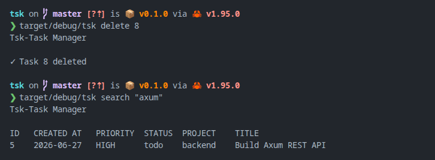
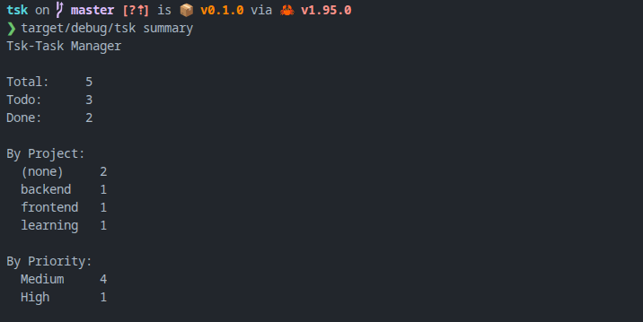

<h1 align="center">tsk</h1>

<p align="center">
  <strong>A fast, minimal CLI task manager built with Rust.</strong>
</p>

<p align="center">
  <a href="#features">Features</a> •
  <a href="#tech-stack">Tech Stack</a> •
  <a href="#getting-started">Getting Started</a> •
  <a href="#usage">Usage</a> •
  <a href="#contributing">Contributing</a> •
  <a href="#license">License</a>
</p>

<p align="center">
  
  
  
</p>

---

## Overview

**tsk** is a lightweight command-line task manager written in Rust. It lets you organize your work with priorities, projects, and status tracking — all from your terminal. Tasks are persisted as human-readable JSON in `~/.tsk/tasks.json`, so your data is always portable and inspectable.

Whether you're managing personal todos or organizing tasks across multiple projects, tsk gives you a fast, distraction-free workflow without ever leaving the command line.

## Features

- **Add Tasks** — Create tasks with a title, priority level, and optional project tag
- **Priority Levels** — Organize work by `low`, `medium`, or `high` priority
- **Project Tagging** — Group related tasks under named projects for better organization
- **Flexible Filtering** — List tasks filtered by any combination of project, priority, and status
- **Case-Insensitive Search** — Find tasks instantly with partial keyword matching
- **Inline Editing** — Update a task's title, priority, or project without recreating it
- **Mark as Done** — Track completion status with a single command
- **Task Summary** — Get an at-a-glance breakdown of tasks by status, project, and priority
- **Persistent Storage** — Tasks are saved as pretty-printed JSON at `~/.tsk/tasks.json`
- **Stable IDs** — Deleted task IDs are never reused, preventing accidental collisions
- **Clean Error Handling** — Friendly error messages instead of panics on invalid input
- **Zero Configuration** — Works out of the box with no setup required

## Demo



## Tech Stack

| Layer | Technology |
|---|---|
| **Language** | [Rust](https://www.rust-lang.org/) (Edition 2024) |
| **CLI Framework** | [clap](https://docs.rs/clap/) 4.6 (derive macros) |
| **Serialization** | [serde](https://serde.rs/) + [serde_json](https://docs.rs/serde_json/) |
| **Date Handling** | [chrono](https://docs.rs/chrono/) 0.4 |
| **Storage** | Local JSON file (`~/.tsk/tasks.json`) |

---

## Getting Started

### Prerequisites

- [Rust](https://www.rust-lang.org/tools/install) 1.85+ (Edition 2024 support)
- [Git](https://git-scm.com/downloads)

### Installation

1. **Clone the repository**

   ```bash
   git clone https://github.com/RusithHansana/tsk.git
   cd tsk
   ```

2. **Build the project**

   ```bash
   cargo build --release
   ```

3. **Install the binary** (optional — adds `tsk` to your PATH)

   ```bash
   cargo install --path .
   ```

4. **Verify the installation**

   ```bash
   tsk --help
   ```

---

## Usage

### Add a task

```bash
tsk add "Build Axum REST API" --priority high --project backend
tsk add "Design React Frontend" --priority medium --project frontend
tsk add "Write unit tests" --priority medium
```



### List tasks

```bash
tsk list
tsk list --project backend
```


You can also filter list results:



### Search tasks

```bash
tsk search "axum"
```



### Edit a task

```bash
tsk edit 5 --priority medium --title "Build Axum Rest API with OAuth2"
```



### Mark a task as done

```bash
tsk done 5
```



### Delete a task

```bash
tsk delete 8
```



### View summary

```bash
tsk summary
```



---

## Project Structure

```
tsk/
├── src/
│   ├── main.rs        # CLI entry point and argument parsing
│   ├── command.rs     # Command handlers (add, list, edit, delete, done, search, summary)
│   ├── store.rs       # Task persistence, filtering, search, and storage logic
│   ├── task.rs        # Task, Priority, Status data models
│   └── display.rs     # Terminal output formatting
├── Cargo.toml         # Project manifest and dependencies
└── Cargo.lock         # Dependency lock file
```

---

## Running Tests

tsk includes a comprehensive test suite covering all modules:

```bash
# Run the full test suite
cargo test

# Run tests for a specific module
cargo test store
cargo test command
cargo test task

# Run tests with output visible
cargo test -- --nocapture
```

---

## Contributing

Contributions are always welcome!

Please read our [Contributing Guide](CONTRIBUTING.md) to learn about our development process, how to propose bugfixes and improvements, and how to build and test your changes.

This project has adopted the [Contributor Covenant Code of Conduct](CODE_OF_CONDUCT.md). By participating, you are expected to uphold this code.

---

## License

This project is licensed under the [MIT License](LICENSE).

---

## Acknowledgements

- [clap](https://docs.rs/clap/) — Powerful command-line argument parser for Rust
- [serde](https://serde.rs/) — Serialization framework for Rust
- [chrono](https://docs.rs/chrono/) — Date and time library for Rust

---

<p align="center">
  Built with ☕ by <a href="https://github.com/RusithHansana">RusithHansana</a>
</p>
